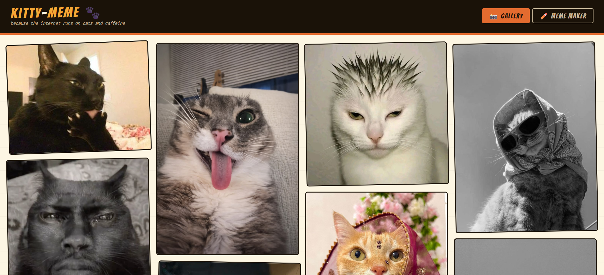

# kitty-meme

A simple cat meme gallery and meme maker using Html , CSS and javascript .

---



---

## What it does

Browse a collection of cat images organized by mood. Click any image to view it fullscreen, download it, or open it in the meme maker. The meme maker lets you add top and bottom text with customizable font, size, and colors, then download the result as a JPEG.

## Structure

```
kitty-meme/
  index.html
  assets/
    *.jpg
```

All images live in the assets folder. The image list is defined directly in the script inside index.html.

## Usage

Just open index.html in a browser. No installation, no server required.

To add new images, drop them into the assets folder and add an entry to the images array in the script:

```js
{ src: "assets/your-image.jpg", alt: "description", moods: ["vibes"] }

```

Available moods: silly, vibes, chaos, sleepy, angry.

## Demo

live Demo : https://kitty-meme-steel.vercel.app/
